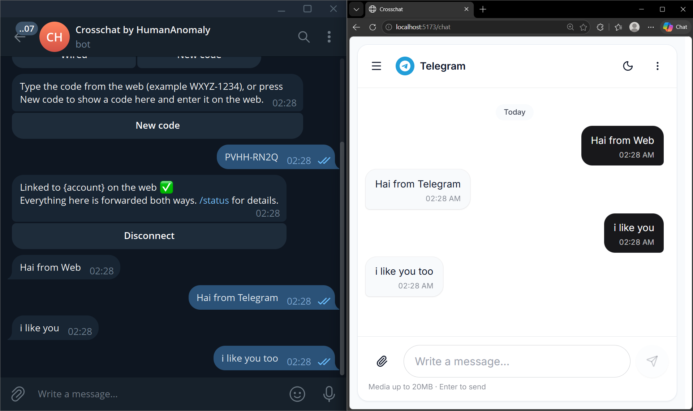
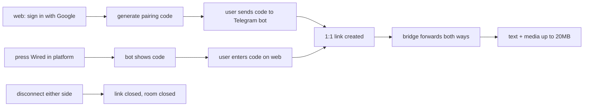

<p align="center">
  
</p>

<h1 align="center">Crosschat</h1>

<p align="center">
  CrossChat is an open-source chat hub that lets anyone chat seamlessly across Telegram, Discord, WhatsApp, and the web, without being tied to a single platform.
</p>

<p align="center">
  <a href="https://github.com/HumanAnomaly/Crosschat"></a>
  <a href="https://github.com/HumanAnomaly/Crosschat/blob/main/LICENSE"></a>
  
  
</p>


## Install

```bash
pnpm i
cp .env.example .env
pnpm generate:secrets
pnpm build
pnpm dev
```

## WhatsApp (zapo.to)

```bash
pnpm --filter @crosschat/whatsapp session:add wa
pnpm --filter @crosschat/whatsapp session:list
pnpm --filter @crosschat/whatsapp session:status wa
pnpm --filter @crosschat/whatsapp session:remove wa
```

Solo per project: `apps/whatsapp` owns the `zapo-js` session. No session or a
broken session means the service runs inactive (`/health` reports
`active:false`) instead of crashing. Pairing uses an 8-char code by default
(`WHATSAPP_PAIR_WITH_CODE=true`); pass `--qr-only` to scan a QR instead.

> Tips: Discord and Telegram work automatically with just a token
> (`DISCORD_BOT_TOKEN` / `TELEGRAM_BOT_TOKEN`): fill in `.env`, build, start,
> done. Every platform is optional: a missing token or a failed service is
> treated as not installed, the rest keeps running (`pnpm start` never requires
> the full set). WhatsApp needs one extra step: a token is not enough, you must
> add a session first (`session:add wa`, then enter the pairing code on your
> phone), and confirm `session:status wa` shows active plus `/health` shows
> `active:true` before linking on the web. Without that, the WA service
> intentionally stays idle and inactive.

## Bot menus & chatting

Each platform exposes the same features through its own native menu:

| Platform | Menu | Commands |
|---|---|---|
| Telegram | Menu button + inline buttons (auto-registered on boot) | `/start` status & actions, `/status` full info, `/help` command list, `/delete` (reply to one of YOUR messages) |
| Discord | Slash commands (auto-deployed on login) | `/start`, `/status`, `/help`, `/wired [code]`, `/newcode`, `/disconnect` |
| WhatsApp | Plain-text commands with `/` prefix (send `/menu` any time) | `/wired`, `/newcode`, `/status`, `/menu`, `/disconnect`, `/delete` (as a reply) |

How chatting works:

1. Link once: generate a code on the web and send it to the bot, or run the
   bot's `newcode`/`/newcode` flow and enter that code on the web.
2. After linking, just chat normally: every message (text, photos, video,
   documents, voice notes up to 20MB) forwards both ways between the web room
   and the platform DM.
3. Delete one of YOUR messages to remove it on both sides (web: right-click /
   long-press; Telegram: `/delete` as a reply; Discord/WhatsApp: delete the
   native message). You can only delete your own messages.
4. Either side can disconnect at any time; the room closes on both sides.

---

## How it works


## License

MIT, see [LICENSE](LICENSE).
