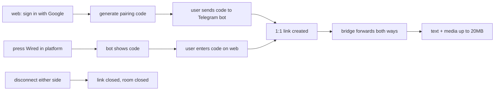

<p align="center">
  
</p>

<h1 align="center">Crosschat</h1>

<p align="center">
  CrossChat is an open-source chat hub that lets anyone chat seamlessly across Telegram, Discord, and the web, without being tied to a single platform.
</p>

<p align="center">
  <a href="https://github.com/HumanAnomaly/Crosschat"></a>
  <a href="https://github.com/HumanAnomaly/Crosschat/blob/main/LICENSE"></a>
  
  
</p>


## Install

```bash
pnpm i
cp .env.example .env
pnpm generate:secrets
pnpm build
pnpm dev
```

---

## How it works


## License

MIT, see [LICENSE](LICENSE).
